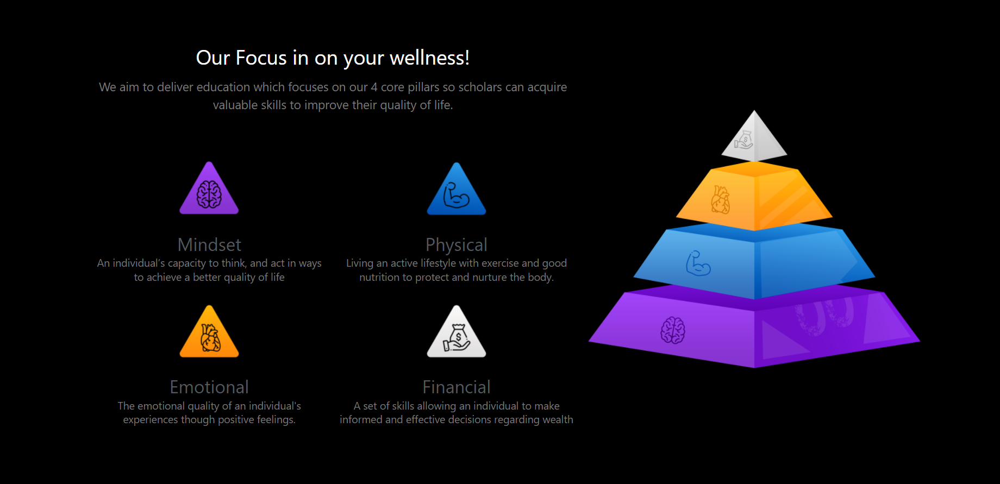

# 4⃣ The Four Pillars

The Four Pillars is the foundation upon which everything else is built. We don't want to just provide our community with financial gain, we want to provide opportunities to increase all aspects of their lives!

## Mindset

"An individual’s capacity to think, and act in ways to achieve a better quality of life."

## Physical

"Living an active lifestyle with exercise and good nutrition to protect and nurture the body."

## Emotional

"The emotional quality of an individual's experiences though positive feelings."

## Financial

"A set of skills allowing an individual to make informed and effective decisions regarding wealth."
